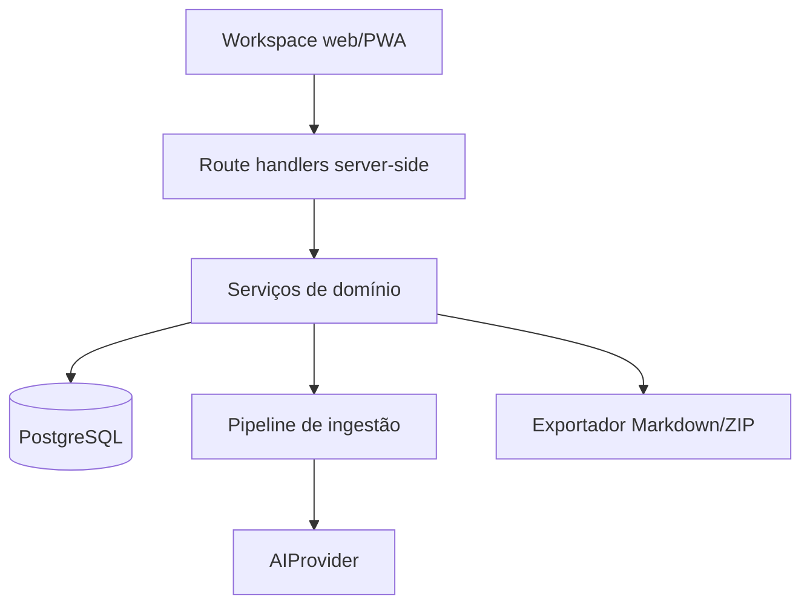

# Architecture — SINAPSE v3

## 1. Escolha

Aplicação full-stack modular em um único repositório Next.js. Isso reduz complexidade operacional do MVP sem misturar responsabilidades: domínio, serviços e repositórios continuam independentes dos componentes e dos handlers HTTP.

## 2. Componentes



## 3. Módulos

- `wikilinks`: parser, normalização e resolução.
- `notes`: CRUD, paths, títulos, autosave e transações.
- `links`: outgoing, backlinks, links quebrados e reindexação.
- `graph`: projeção de notas/links para Graphology.
- `ingestion`: normalização, chunking, extração, merge, preview e commit.
- `ai`: interface de provider, provider real e fake determinístico.
- `export`: serialização segura do vault.
- `search`: PostgreSQL full-text ou busca simples indexada no MVP; embeddings depois.

## 4. Modelo de dados mínimo

### users

Gerenciado pela solução de autenticação escolhida.

### vaults

- `id uuid pk`
- `user_id uuid not null`
- `name text not null`
- `created_at timestamptz`
- `updated_at timestamptz`
- unique apropriado por usuário

Mesmo que o MVP exponha um único vault, modelar `vaults` evita acoplamento futuro.

### vault_notes

- `id uuid pk`
- `vault_id uuid not null`
- `user_id uuid not null` (defesa em profundidade)
- `path text not null`
- `title text not null`
- `normalized_title text not null`
- `content_markdown text not null`
- `tags jsonb not null default []`
- `created_at`, `updated_at`
- unique `(vault_id, path)`
- índices `(user_id, vault_id)`, `(vault_id, normalized_title)`

### vault_links

- `id uuid pk`
- `vault_id uuid not null`
- `source_note_id uuid not null`
- `target_note_id uuid null`
- `target_text text not null`
- `target_normalized text not null`
- `alias text null`
- `occurrence_count integer not null`
- `kind enum: wikilink | suggested | confirmed`
- timestamps
- índice em `source_note_id`, `target_note_id`, `(vault_id, target_normalized)`

`target_note_id` nulo representa link ainda não resolvido.

### ingestions

- `id uuid pk`
- `vault_id`, `user_id`
- `input_type`
- `source_name`
- `content_hash`
- `raw_text` ou referência segura ao objeto original
- `status`
- `created_at`, `updated_at`
- unique idempotente por `(vault_id, content_hash, mode)` quando apropriado

### ai_jobs

- `id uuid pk`
- `ingestion_id`
- `status: queued | running | awaiting_review | committed | failed | cancelled`
- `stage`
- `progress integer`
- `attempts`
- `provider`
- `model`
- `error_code`, `error_message_safe`
- `result_json jsonb`
- timestamps

### attachments

- metadados do arquivo;
- storage key server-side;
- MIME, hash, tamanho;
- nunca confiar somente na extensão.

### note_embeddings (pós-MVP)

Separada das notas para permitir troca de modelo e reindexação.

## 5. Wikilinks

Suportar:

- `[[Título]]`
- `[[Título|Alias visível]]`
- opcionalmente path explícito se necessário.

Regras:

1. Ignorar wikilinks dentro de fenced code blocks e inline code.
2. Preservar texto original no Markdown.
3. Normalizar para resolução sem destruir acentos no conteúdo exibido.
4. Resolver primeiro match exato de path, depois título único normalizado.
5. Se houver colisão de títulos, manter não resolvido e pedir desambiguação; nunca escolher aleatoriamente.
6. Ao renomear/mover, atualizar relações; reescrever Markdown só mediante operação explícita e transacional.

## 6. Salvamento de nota

```text
autenticar -> autorizar vault -> validar path/conteúdo -> iniciar transação
-> upsert nota -> parsear wikilinks -> substituir outgoing indexados
-> resolver destinos possíveis -> commit -> invalidar caches -> atualizar UI
```

Use controle otimista por `updatedAt` ou versão para reduzir sobrescrita entre abas.

## 7. Ingestão

Estágios:

1. `received`
2. `normalizing`
3. `chunking`
4. `extracting`
5. `merging`
6. `planning`
7. `awaiting_review`
8. `committing`
9. `reindexing`
10. `completed`

Chunks devem respeitar parágrafos/títulos quando possível, carregar pequena sobreposição e ter IDs/hashes determinísticos.

O merge deve comparar título normalizado, path, tags, links e sinais de conteúdo. Similaridade nunca autoriza apagar uma nota automaticamente.

## 8. Plano antes do commit

A IA produz dados estruturados. O servidor converte isso em operações:

- `create_note`
- `append_section`
- `replace_managed_section`
- `add_link`
- `add_tag`
- `flag_possible_duplicate`
- `update_master_context`

Operações destrutivas exigem confirmação explícita. O commit revalida autorização e versão das notas.

## 9. Graph projection

O endpoint retorna IDs e atributos mínimos:

```ts
type GraphNode = { id: string; title: string; path: string; tags: string[]; degree: number }
type GraphEdge = { id: string; source: string; target: string; kind: string; weight: number }
```

Nós usam `note.id`. Layout inicial pode usar ForceAtlas2 em worker, armazenando posições preferidas localmente ou no servidor em tabela separada. Não bloquear o editor enquanto calcula layout.

## 10. Exportação

1. Autorizar vault.
2. Buscar notas em streaming/paginação.
3. Validar e normalizar cada path.
4. Serializar frontmatter simples e Markdown.
5. Criar ZIP sem paths absolutos ou `..`.
6. Gerar nome estável e responder como download.

Teste o ZIP descompactando em diretório temporário e conferindo nomes e conteúdo.

## 11. Busca e RAG

MVP: busca por título, path, tags e conteúdo no PostgreSQL. “Perguntar ao cérebro” deve citar links internos das notas usadas. Embeddings são uma melhoria posterior, não pré-requisito.

## 12. Auth e isolamento

- Sessão verificada no servidor.
- Toda operação parte do usuário da sessão.
- Repositórios recebem um `RequestContext` autenticado.
- Testes criam pelo menos dois usuários e provam não vazamento.
- Se o provedor de PostgreSQL oferecer RLS, pode ser defesa adicional; não substitui autorização na aplicação.

## 13. Observabilidade

- logs estruturados com request/job IDs;
- nada de raw input pessoal ou secrets em logs;
- duração por estágio;
- erros sanitizados ao cliente e detalhe interno seguro;
- endpoint/visão de status do job.

## 14. ADRs obrigatórias

- autenticação;
- estratégia de jobs no MVP;
- estratégia de armazenamento de anexos;
- política de resolução de títulos duplicados.
